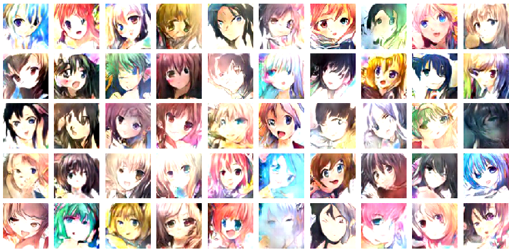
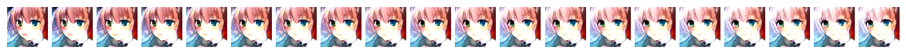
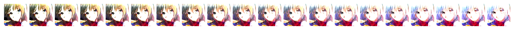
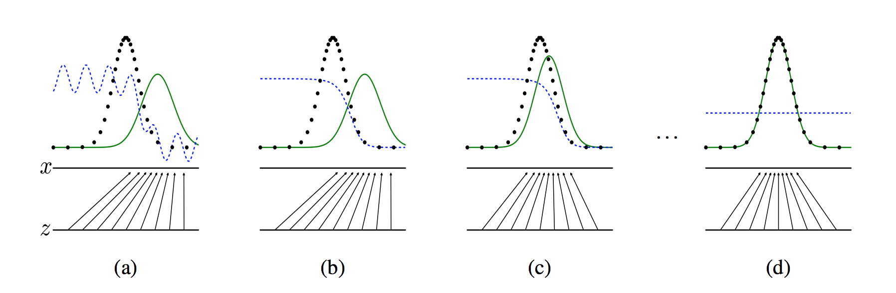
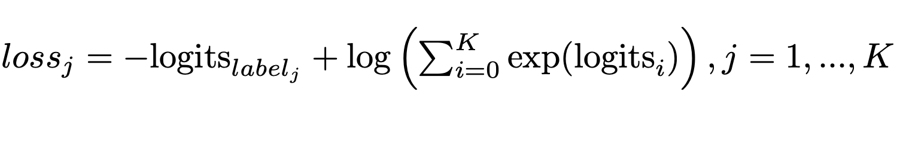
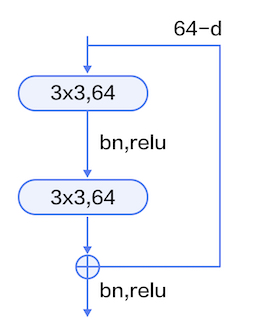
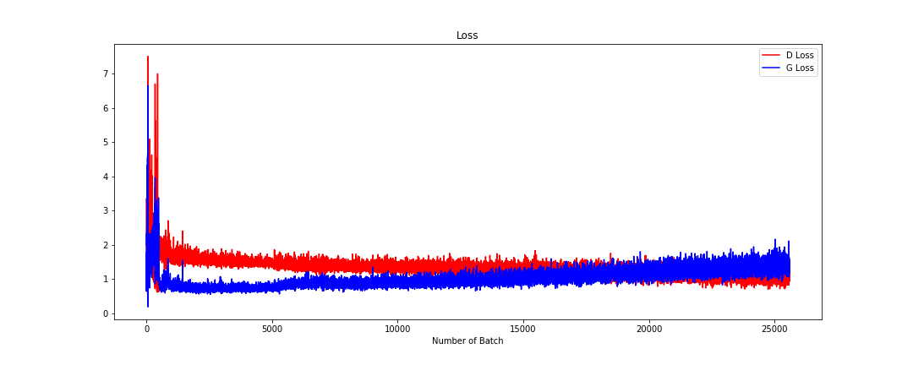

想画出独一无二的动漫头像吗？不会画也没关系！只需要输入一些随机数让卷积神经网络为你画出精致并且独一无二的动漫头像！

同时本项目也是绝佳的学习DCGAN的例子，通过趣味解读深入浅出地了解GAN的魔法世界!

**效果展示**

1.完全由机器进行构图和绘画出来的二次元人物头像，细看有些图片足以以假乱真

2.横向对比

每次生成一组shape为[1,72]的随机数，平均更改其中某个数值，依次生成20组随机数，输入生成器，得到横向对比图片，得到GAN神奇的过渡

改变发色深浅

改变头发颜色

 

**知识补充**

   ***1.GAN介绍***

论文地址：https://arxiv.org/abs/1406.2661

> 生成对抗网络（Generative Adversarial Network ，简称GAN）由一个生成网络与一个判别网络组成。生成网络从潜在空间（latent space）中随机采样作为输入，其输出结果需要尽量模仿训练集中的真实样本。判别网络的输入为真实样本或生成网络的输出，其目的是将生成网络的输出从真实样本中尽可能分辨出来。而生成网络则要尽可能地欺骗判别网络。两个网络相互对抗、不断调整参数，其目的是将生成网络生成的样本和真实样本尽可能的区分开。
>
> 生成对抗网络常用于生成以假乱真的图片 。此外，该方法还被用于生成视频、三维物体模型等。
>
> 以下是GAN训练过程：
>
> 

​    ***2.DCGAN介绍***

论文地址：https://arxiv.org/abs/1511.06434

> DCGAN是深层卷积网络与 GAN 的结合，其基本原理与 GAN 相同，只是将生成网络和判别网络用两个卷积网络（CNN）替代。为了提高生成样本的质量和网络的收敛速度，论文中的 DCGAN 在网络结构上进行了一些改进：
>
> 取消 pooling 层、加入 batch normalization、使用全卷积网络、去掉了FC层。
>
> 激活函数：在生成器（G）最后一层使用Tanh函数，其余层采用 ReLu 函数 ; 判别器（D）中都采用LeakyReLu。
>
> 
>
> 但是在实际过程中，很难得到这个完美的平衡点，关于GAN的收敛理论还在持续不断的研究中。 

**实现过程**

*本项目由Chainer项目[Chainerで顔イラストの自動生成](https://link.zhihu.com/?target=http%3A//qiita.com/mattya/items/e5bfe5e04b9d2f0bbd47)改写为PaddlePaddle项目*

***1.对原项目的改进：***

> 1.将Adam优化器beta1参数设置为0.8，具体请参考[原论文](https://arxiv.org/abs/1412.6980)，进一步缓解梯度消失/爆炸问题
>
> 2.将BatchNorm批归一化中momentum参数设置为0.5，调参后网络训练过程加快
>
> 3.将判别器(D)激活函数由elu改为leaky_relu，并将alpha参数设置为0.2，elu与leaky_relu相比效果并不明显，这里改用计算复杂度更低的leaky_relu
>
> 4.在判别器(D)中增加Dropout层，并将dropout_prob设置为0.4，避免过拟合和梯度消失/爆炸问题
>
> 5.将生成器(G)中的第一层全连接层改为基本残差模块，使得收敛加快学习并使得网络学习到的特征更丰富

改进后，网络收敛速度明显加快，原项目训练时间需要300个epoch训练超过10h，改进后训练epoch仅需要90个epoch训练时间3个小时左右，同时结果特征更丰富。

***2.开发环境***：

​	PaddlePaddle1.7.1,Python3.7,Scikit-image,openCV等

***3.数据集***

数据集通过参考网络上的爬虫代码结合[openCV工具](https://github.com/nagadomi/lbpcascade_animeface)进行头像截取，爬取著名的动漫图库网站的http://safebooru.donmai.us/和http://konachan.net/ 的动漫图片。

***4.损失函数：***

***5.项目目录结构及模块说明***

* Pretreatment文件夹：数据集爬取
* DataSet文件夹：数据集
* Res文件夹：Markdown资源文件
* Model文件夹：模型文件存放，可用于增量训练
* Net.py：网络功能模块及生成器判别器定义
* Reader.py：数据集Reader定义
* Run.py：通过Model内模型进行横向对比
* Train.py：训练网络
* Utils.py：其他功能模块

> 定义网络功能模块 

包括卷积池化组、BatchNorm层、全连接层、反卷积层、卷积BN层

> 定义基本残差模块

残差模块如图所示，本文采用的是基本模块连接方式，由两个输出通道数相同的3x3卷积组成。

> 判别器

* 将BatchNorm批归一化中momentum参数设置为0.5
* 将判别器(D)激活函数由elu改为leaky_relu，并将alpha参数设置为0.2
* 在判别器(D)中增加Dropout层，并将dropout_prob设置为0.4

输入为大小96x96的RGB三通道图片

输出结果经过一层全连接层最后为shape为[batch_size,2]的Tensor

> 生成器

* 将BatchNorm批归一化中momentum参数设置为0.5
* 将生成器(G)中的第一层全连接层改为基本残差模块

输入Tensor的Shape为[batch_size,72]其中每个数值大小为0~1之间的float32随机数

输出为大小96x96RGB三通道图片

> 损失函数选用softmax_with_cross_entropy,公式如下:

> 训练网络

设置的超参数为：

- 学习率：2e-4
- Epoch: 300
- Mini-Batch：100
- 输入Tensor长度：72 

得到的损失变化曲线为：

***6.项目总结***

​	简单介绍了一下DCGAN的原理，通过对原项目的改进和优化，一步一步依次对生成器和判别器以及训练过程进行介绍。 通过横向对比某个输入元素对生成图片的影响。平均更改其中某个数值，依次生成20组随机数，输入生成器，得到横向对比图片，得到GAN神奇的过渡。

​	DCGAN生成的二次元头像仔细看有些图片确实是足以以假乱真的，通过DCGAN了解到GAN的强大“魔力”。不足之处是生成的图片分辨率比较低（96X96），在以后的项目我会通过改进网络使得生成的二次元头像有更高的分辨率和更丰富的细节。

